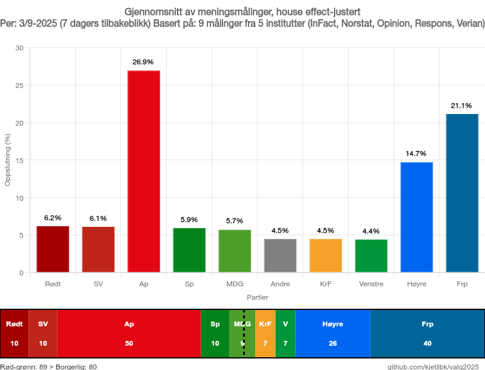
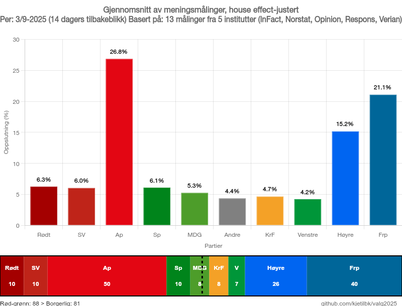

# House effect-justerte meningsmålinger

Regner på norske meningsmålinger og korrigerer for systematiske skjevheter i måleinstituttene.

## Siste målinger

### 7-dagers gjennomsnitt


### 14-dagers gjennomsnitt


## Hva

Når måleinstitutter publiserer meningsmålinger, har mange av dem systematiske skjevheter - noen overestimerer eller underestimerer konsekvent enkelte partier. Dette kalles "house effects".

**For eksempel:**
- Verian pleier å måle Ap 1,9 prosentpoeng høyere enn gjennomsnittet
- Norfakta underestimerer ofte Frp med 1,5 prosentpoeng
- InFact har en tendens til å underestimere både Ap og Høyre

## Hvordan løser vi dette?

1. **Vi samler inn alle meningsmålinger** fra de store instituttene (InFact, Norfakta, Norstat, Opinion, Respons, Verian)

2. **Vi beregner house effects** ved å sammenligne hvert institutt med gjennomsnittet av alle andre målinger i samme tidsperiode

3. **Vi korrigerer målingene** ved å justere for disse systematiske skjevhetene

4. **Vi lager diagrammer** som viser den korrigerte situasjonen

## Hvordan generere nye diagrammer

```bash
# Komplett analyse med både målinger og mandater
pnpm all           # 14 dager (standard)
pnpm all 7         # 7 dager
pnpm all 21        # 21 dager

# Bare meningsmålinger
pnpm chart 14      # 14-dagers gjennomsnitt

# Se hvilke institutter som har skjevheter
pnpm house-effects
```

## Datakilder

Måledata og mandatberegninger kommer fra **Poll of Polls** (pollofpolls.no)